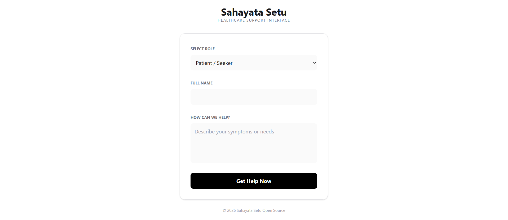
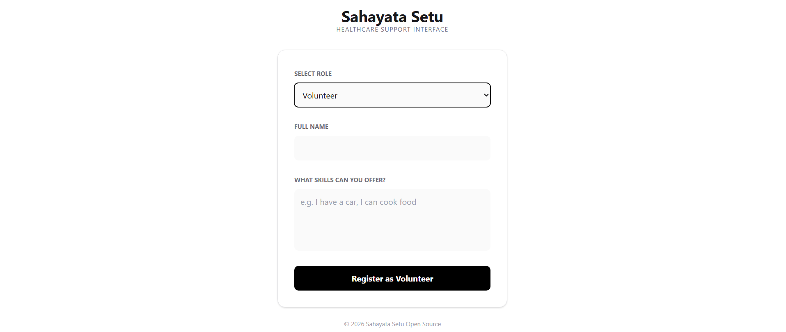

# 🩺 Sahayata Setu – Healthcare Support Interface

Sahayata Setu is a small web application made using **Flask**, **HTML**, **CSS**, and **JavaScript**.  
It allows **patients** to request help and **volunteers** to register their skills.  
The system gives a basic AI-style analysis based on keywords.

This project is mainly for **learning and demo purposes** only.

---

## ✨ Features

- Patient can submit health related issues  
- Volunteer can register skills (doctor, driver, counselor, etc.)  
- Simple keyword based analysis  
- Shows urgency level for patients  
- Assigns team and badge for volunteers  
- Clean and minimal UI  
- Beginner friendly Flask backend  

---

## 🛠️ Tech Stack

- **Backend:** Python (Flask)  
- **Frontend:** HTML, CSS  
- **Logic:** JavaScript + Python  
- **API:** JSON based POST request  

---

## 📁 Project Structure

```text
sahayata-setu/
│
├── app.py
├── templates/
│   └── index.html
└── README.md

```
## 🖼️ Screenshots

### 1️⃣ Home Page


### 2️⃣ Patient Triage Result


### 3️⃣ Volunteer Skill Match


## 🧠 How It Works
## 👤 Patient Mode

User selects Patient

Enters their problem

System checks keywords like:

emergency, pain, bleeding → High urgency

fever, appointment → Medium urgency

Displays:

Category

Urgency level

Auto response message

## 🤝 Volunteer Mode

User selects Volunteer

Enters skills

System checks keywords like:

doctor, nurse → Medical Team

car, drive → Transport Team

talk, listen → Counseling Team

Displays:

Assigned team

Skill badge

Welcome message


## 📌 Future Improvements

Database support

Login system

Real AI / ML model

Admin dashboard

SMS / Email notifications

